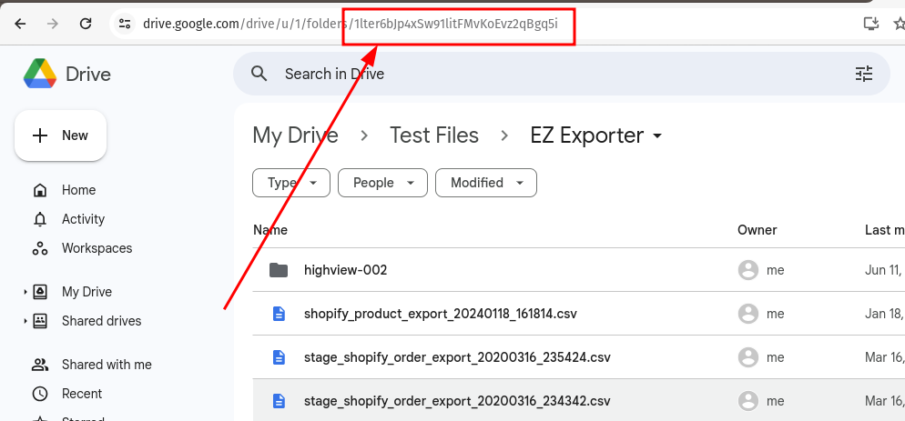

To find a **Google Drive Folder ID**, follow these steps:

### **Method 1: From the URL**
1. Open Google Drive ([drive.google.com](https://drive.google.com)).
2. Navigate to the folder you want.
3. Look at the URL in your browser. It will be in the format:
   ```
   https://drive.google.com/drive/folders/FOLDER_ID
   ```
4. The **FOLDER_ID** is the part after `/folders/`.
<!-- truncate -->

